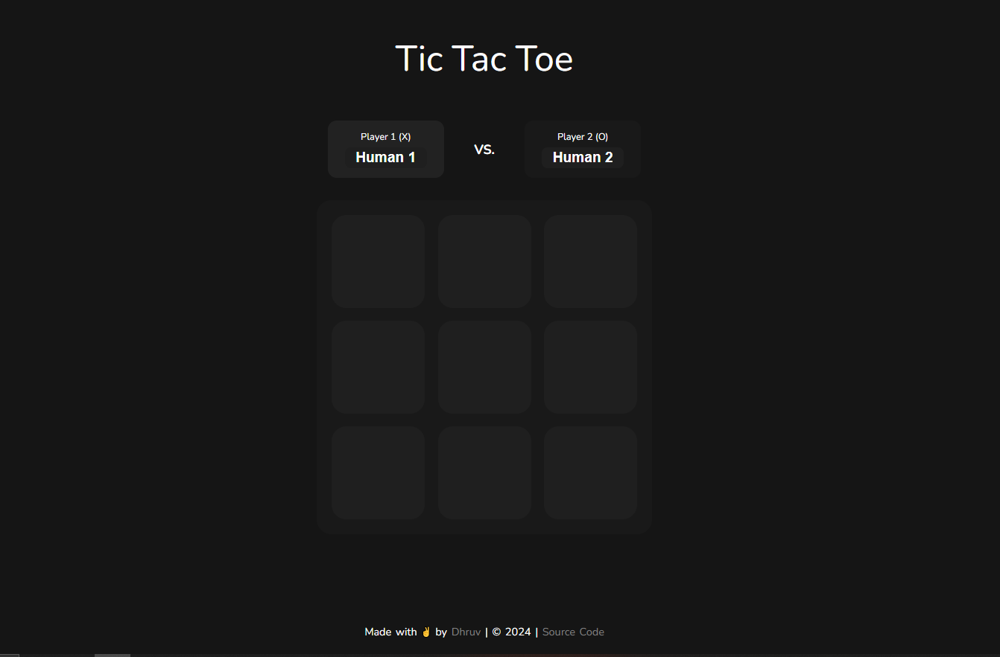
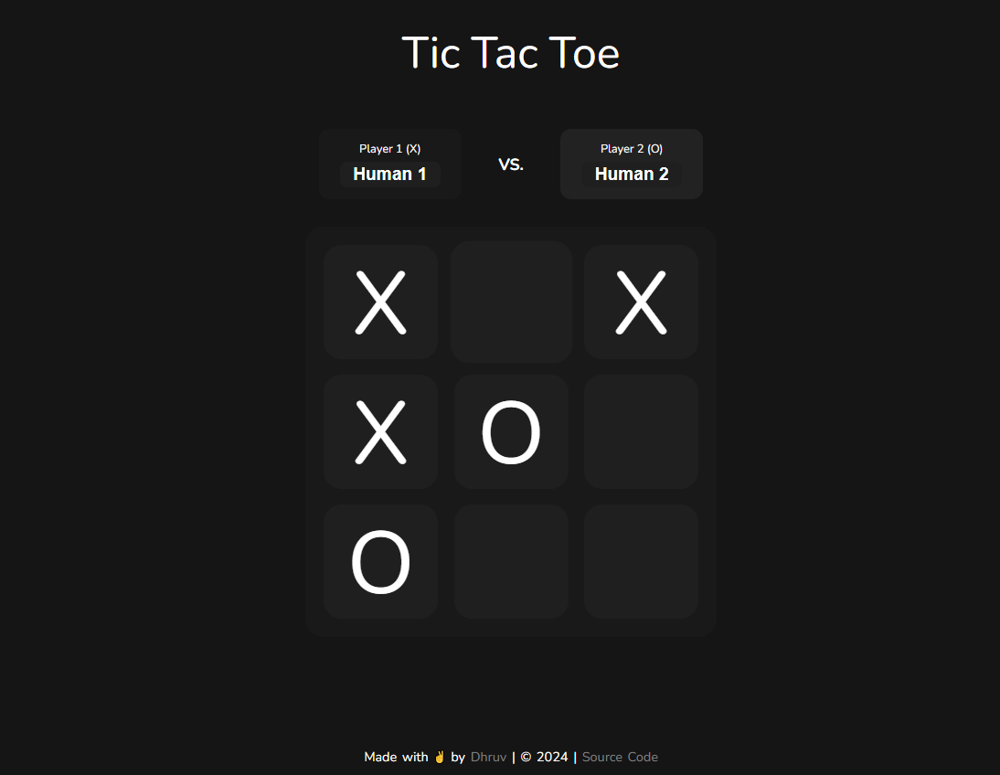
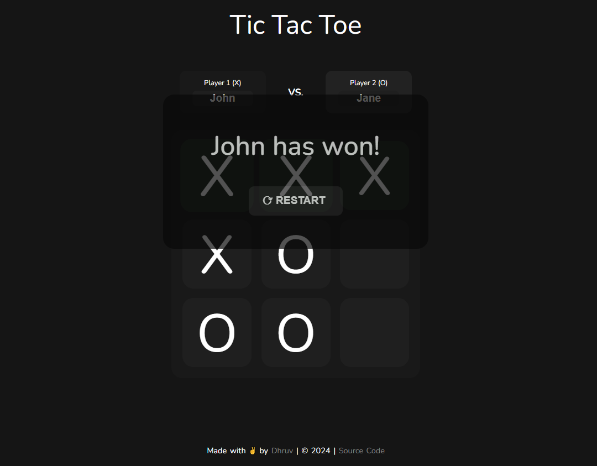
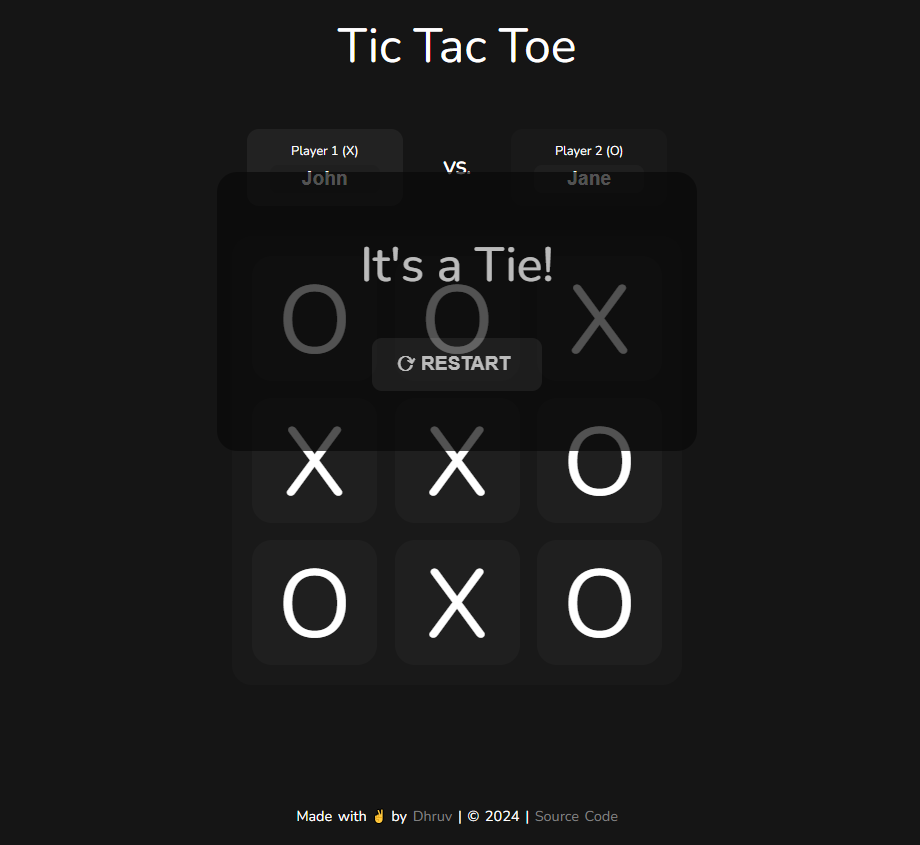

# Tic Tac Toe Game

This is a classic two-player offline Tic Tac Toe game developed using HTML, CSS, and JavaScript. Players can enter their names, take turns marking X and O on  game board, and the game announces the winner or declares a tie. A restart button allows for a new game session.

## Features

- **Two Player Offline**: Compete against a friend locally.
- **Player Name Input**: Customize player names for a personalized experience.
- **Win and Tie Detection**: Detects and displays the winner's name or announces a tie.
- **Start Button**: Begin the game by clicking the 'Start' button.

## Screenshots

### Game Start

### In Progress

### Winner Declared

### Tie Situation

## Usage

1. Clone the repository:
git clone https://github.com/iDhruv11/Tic-Tac-Toe-Javscript.git

## Credits

- Developed by [Dhruv](https://github.com/iDhruv11)
- Design Inspiration from [here](https://github.com/emuel-vassallo/tic-tac-toe)

